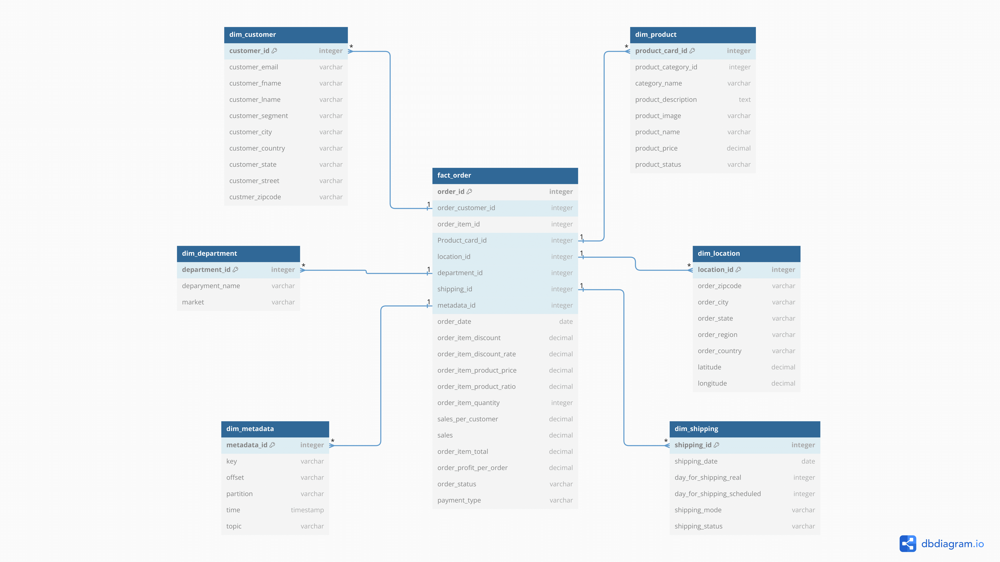
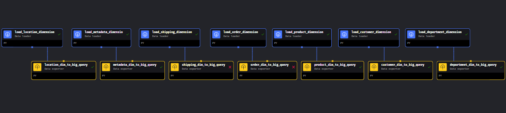

# Batch Pipeline Overview

The Batch Pipeline is a critical component in the data processing architecture, designed to handle large volumes of data efficiently. It consists of two main parts:

## Spark Pipeline

The Spark Pipeline is responsible for processing raw data sourced from GCS, performing necessary OLAP (Online Analytical Processing) transformations, and storing the transformed data back into GCS as Silver level data. This pipeline facilitates data refinement and preparation for downstream analytics tasks. [Pipeline Folder](./export_to_gcs/)

### Pipeline Execution
To initiate the Spark Pipeline, start Spark with the command `start-spark` and then `olap-transformation-pipeline`. This command kickstarts the data transformation process, leveraging the power of Spark's distributed computing capabilities.

### Architecture Overview
The Batch Pipeline architecture involves a series of data flows and transformations:

1. **Data Ingestion**: Data is sourced from CSV files and offline data stores, then sent to the Kafka message broker's topic `supply_chain_data`.
  
2. **Data Consumption**: The data is consumed from Kafka by PostgreSQL database and a GCS bucket, where it is stored as raw_streaming data.

3. **Transformation**: The Spark Pipeline processes the raw data, applying OLAP transformations to derive valuable insights and prepare it for analytical purposes.

4. **Export to BigQuery**: The Mage Pipeline exports the transformed data from GCS to BigQuery, making it accessible for analysis and reporting.

### Database Design
The transformed data is structured according to a well-defined database design, ensuring consistency, efficiency, and ease of access for analytical queries.

## Mage Pipeline

The Mage Pipeline is responsible for exporting transformed (Silver level) data from Google Cloud Storage (GCS) and ingesting it into BigQuery. This pipeline plays a crucial role in ensuring that the processed data is readily available for analysis and reporting in BigQuery.
[Pipeline Folder](./export_to_big_query/)

### Pipeline Execution
To execute the Mage Pipeline, run the commands `start-mage` and then `gcs-to-bigquery-pipeline`. This command triggers an API request to Mage, instructing it to initiate the pipeline execution.

### API Credentials
Ensure that the API credentials for accessing Mage are correctly configured in the source file. This step is essential for seamless integration and secure data transfer between GCS and BigQuery.

### Automated Execution
For streamlined execution, all these steps can be combined into a single command: `start-batch-pipeline`.

## Summary
The Batch Pipeline plays a crucial role in the data processing workflow, enabling the efficient transformation and storage of data for analytical purposes. By leveraging Mage and Spark pipelines, organizations can streamline their data processing tasks and derive valuable insights from large datasets stored in GCS and BigQuery.For debugging errors check the file: [Debug](../debug.md).