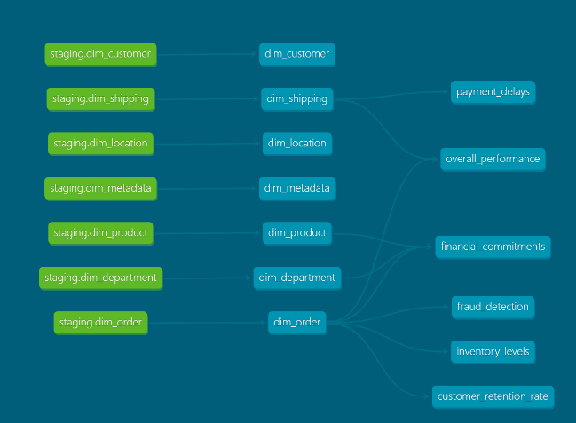

# DBT Business Transformation Models Overview

DBT (Data Build Tool) is a powerful data transformation tool used to convert Silver level transformed data in BigQuery into Gold level business transformations. Through the creation of Core models derived from dimensional (dim) and fact tables, DBT enables organizations to extract valuable insights and drive informed decision-making across various business domains.

## Executing in dbt-cloud cli

Using python method
- `pip3 install dbt --no-cache-dir` then
-  Download your cloud-configuration from the dbt-cloud Project page. For Demo purposes, I have provided my dbt_project.yaml file in the `business_transformations` folder
- Use these commands
 - `mkdir ~/.dbt`
 - `cp business_transformations/dbt_project.yaml ~/.dbt/` .
- Check using `dbt compile`
- Run the models using `dbt run command`
- To run specific model `dbt run --select {model_name}`

## Lineage Graph

## Inventory Levels
[Model](./models/core/inventory_levels.sql)

### Total Inventory Value Over Time
This model calculates the total value of inventory over time, providing stakeholders with insights into inventory trends and fluctuations.

### Inventory Turnover Ratio
The inventory turnover ratio is computed as the ratio of sales to average inventory, offering insights into how efficiently inventory is being managed and utilized.

### Inventory Aging Analysis
This analysis involves the distribution of inventory by age, allowing stakeholders to assess the aging of inventory and make informed decisions regarding stock management and liquidation.

**Partitioning and Clustering**: Partitioning and clustering have been implemented on the `order_date` column to optimize performance for time-based queries and aggregations.

## Payment Delays
[Model](./models/core/payment_delays.sql)

### Average Payment Delay
This model calculates the average payment delay for different suppliers or customers, enabling organizations to identify patterns and trends in payment behavior.

### Distribution of Payment Delays
By generating a histogram of payment delay periods, this model offers insights into the distribution of payment delays, helping organizations identify outliers and areas for improvement in payment processing.

**Partitioning and Clustering**: Partitioning and clustering have been implemented on the `order_customer_id` column to optimize grouping and ordering operations.

## Financial Commitments
[Model](./models/core/financial_commitments.sql)

### Total Committed Funds
This model tracks the total committed funds, such as orders placed but not yet fulfilled, providing stakeholders with visibility into future financial obligations.

### Commitment Fulfillment Rate
The commitment fulfillment rate is computed as the ratio of fulfilled commitments to total commitments, offering insights into the organization's ability to fulfill its financial obligations.

### Financial Commitments Analysis
This analysis segments financial commitments by department, market, or product category, allowing stakeholders to understand where financial resources are allocated and identify opportunities for optimization.

**Partitioning and Clustering**: Partitioning and clustering have been implemented on relevant columns to optimize performance for financial analysis and segmentation.

## Overall Performance
[Model](./models/core/overall_performance.sql)

### Key Performance Indicators (KPIs)
This model calculates essential KPIs such as revenue, profit margins, and customer satisfaction scores, providing stakeholders with a comprehensive view of overall business performance.

### Comparative Performance Analysis
By comparing performance metrics across different regions or departments, this analysis identifies areas of strength and areas requiring improvement, enabling targeted interventions to drive business growth.

### Trend Analysis
Trend analysis identifies growth opportunities or areas for improvement by analyzing historical data trends, allowing stakeholders to make data-driven decisions to drive business success.

**Partitioning and Clustering**: Partitioning and clustering have been implemented on relevant columns to optimize performance for historical data analysis and comparison.

## Supply Chain Optimization/ Fraud Detection
[Model](./models/core/fraud_detection.sql)

### Supply Chain Lead Time Analysis
This model analyzes supply chain lead times, identifying opportunities to streamline processes and reduce time-to-market for products and services.

### Order Fulfillment Cycle Time Analysis
By analyzing order fulfillment cycle times, this model identifies bottlenecks in the supply chain process, enabling organizations to optimize workflows and improve operational efficiency.

### Bottleneck Identification
Identifying bottlenecks in the supply chain process enables organizations to implement targeted interventions to improve throughput and enhance overall supply chain performance.

**Partitioning and Clustering**: Partitioning and clustering have been implemented on relevant columns to optimize performance for supply chain analysis and bottleneck identification.

DBT Business Transformation Models empower organizations to unlock the full potential of their data by transforming raw information into actionable insights and strategic initiatives. With a focus on key business domains such as inventory management, financial analysis, performance monitoring, and supply chain optimization, these models drive efficiency, innovation, and growth across the organization.
