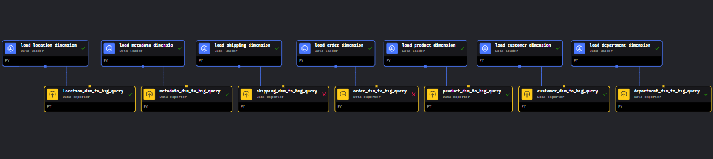

# Streaming Pipeline Overview

The Streaming Pipeline is a dynamic component designed to process continuous streams of data in real-time. Leveraging Kafka Streaming and Mage, this pipeline efficiently handles data ingestion, processing, and storage.[Pipeline folder](../streaming_pipeline/)

## Architecture

### Data Flow
Data is sourced from various producers, including CSV files and offline retail stores. These sources feed data into a Docker container running a streaming service. The streaming service then publishes the data to the Kafka message broker's topic named "supply_chain_data."

### 

## Mage Pipeline Integration

In the Mage Pipeline integration, a Kafka consumer block consumes data from the Kafka topic. Subsequently, the data is streamed into a GCS bucket in the form of raw_streaming.parquet files. [Pipeline folder](./kafka_to_gcs_streaming/)

### 
*(Image Placeholder: Insert Mage Pipeline Linear Diagram)*

## Pipeline Execution

### Steps to Start the Pipeline
To initiate the Streaming Pipeline, the following steps are required:

1. **Start Kafka**: Begin by starting Kafka with the command `start-kafka`. This command launches Kafka within a Docker container, exposing it at port kafka:29092.

2. **Produce Data**: Activate the data streaming process by starting the streaming container with the command `stream-data`.

3. **Start Mage**: Commence the Mage Pipeline by initiating Mage with the command `start-mage`. This command triggers the pipeline execution, facilitating data ingestion, processing, and storage.

### Automated Execution
For streamlined execution, all these steps can be combined into a single command: `start-streaming-pipeline`.

## Summary
The Streaming Pipeline, powered by Kafka Streaming and Mage, enables the seamless processing of continuous data streams. By efficiently handling data ingestion, transformation, and storage, this pipeline facilitates real-time analytics and insights generation. With a clear architecture and automated execution capabilities, the Streaming Pipeline serves as a cornerstone for data-driven decision-making and business intelligence.For debugging errors check the file: [Debug](../debug.md).